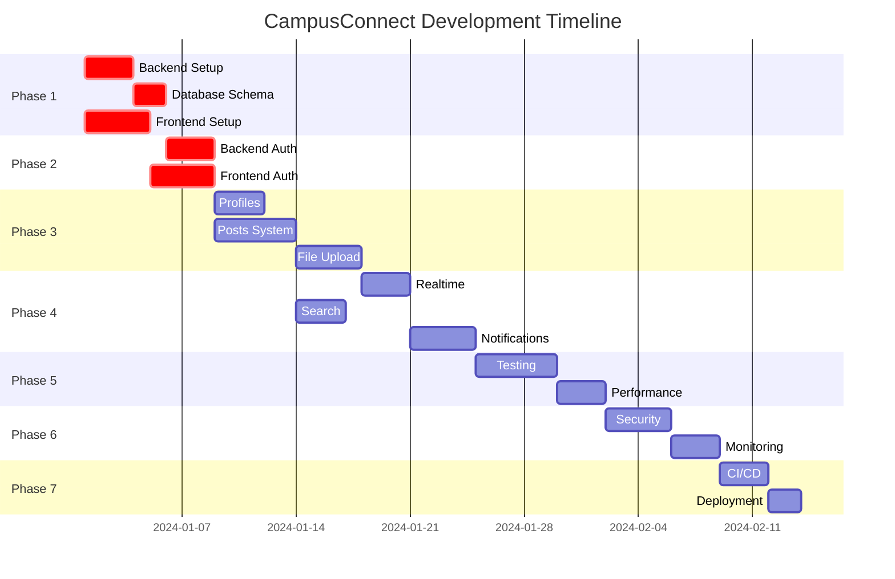

# CampusConnect Development Tasks

## Phase 1: Foundation Setup (Week 1-2)

### 1.1 Backend Infrastructure Setup
**Priority: Critical | Estimated: 3 days**

- [ ] **Task 1.1.1**: Express.js Server Setup
  - Create proper Express server structure
  - Configure middleware stack (helmet, cors, compression, morgan)
  - Set up environment configuration
  - **Files**: `src/server.js`, `src/config/`, `src/middleware/`

- [ ] **Task 1.1.2**: API Gateway Implementation
  - Implement rate limiting (15min/100 requests per IP)
  - Add user throttling (1min/30 requests per user)
  - Set up API key authentication for external services
  - **Files**: `src/middleware/rateLimiting.js`, `src/middleware/apiAuth.js`

- [ ] **Task 1.1.3**: Supabase Integration
  - Configure Supabase client with proper settings
  - Set up connection pooling and error handling
  - Create database utility functions
  - **Files**: `src/lib/supabase.js`, `src/lib/database.js`

### 1.2 Database Schema Implementation
**Priority: Critical | Estimated: 2 days**

- [ ] **Task 1.2.1**: Core Tables Creation
  - Create profiles, posts, comments, likes tables
  - Set up file_uploads and notifications tables
  - **Files**: `migrations/001_core_tables.sql`

- [ ] **Task 1.2.2**: Storage Buckets Setup
  - Configure 'avatars' and 'post-media' buckets
  - Set up RLS policies for storage access
  - **Files**: `migrations/002_storage_setup.sql`

- [ ] **Task 1.2.3**: Search & Indexing
  - Implement full-text search with tsvector
  - Create performance indexes
  - Set up search triggers
  - **Files**: `migrations/003_search_setup.sql`

- [ ] **Task 1.2.4**: Realtime Configuration
  - Enable realtime for posts, comments, likes, notifications
  - **Files**: `migrations/004_realtime_setup.sql`

### 1.3 Frontend Foundation
**Priority: Critical | Estimated: 4 days**

- [ ] **Task 1.3.1**: Project Structure Setup
  - Organize folder structure per design
  - Configure Vite, TypeScript, Tailwind
  - Set up path aliases and imports
  - **Files**: `src/` structure, `vite.config.ts`, `tsconfig.json`

- [ ] **Task 1.3.2**: Supabase Client Setup
  - Configure Supabase client for frontend
  - Set up environment variables
  - Create API service layer
  - **Files**: `src/lib/supabase.ts`, `src/lib/api.ts`

- [ ] **Task 1.3.3**: TanStack Query Setup
  - Configure query client with caching strategy
  - Set up error handling and retry logic
  - **Files**: `src/lib/queryClient.ts`, `src/providers/QueryProvider.tsx`

- [ ] **Task 1.3.4**: Router & Layout Setup
  - Configure React Router with protected routes
  - Create main layout components
  - **Files**: `src/App.tsx`, `src/components/layout/`, `src/components/ProtectedRoute.tsx`

## Phase 2: Authentication System (Week 2-3)

### 2.1 Backend Authentication
**Priority: Critical | Estimated: 3 days**

- [ ] **Task 2.1.1**: Auth Routes Implementation
  - POST /auth/signup, /signin, /signout, /refresh
  - GET /auth/me with user profile data
  - **Files**: `src/routes/auth.js`, `src/controllers/authController.js`

- [ ] **Task 2.1.2**: OAuth Integration
  - Google OAuth setup and configuration
  - OAuth callback handling
  - **Files**: `src/services/oauthService.js`, `OAUTH_SETUP.md`

- [ ] **Task 2.1.3**: JWT Middleware
  - Token validation middleware
  - User context injection
  - **Files**: `src/middleware/auth.js`

### 2.2 Frontend Authentication
**Priority: Critical | Estimated: 4 days**

- [ ] **Task 2.2.1**: Auth Context Provider
  - Create AuthContext with user state management
  - Implement sign in/up/out functions
  - Handle session persistence
  - **Files**: `src/context/AuthContext.tsx`, `src/hooks/useAuth.ts`

- [ ] **Task 2.2.2**: Auth Components
  - Login/Register forms with validation
  - OAuth login buttons
  - Password reset functionality
  - **Files**: `src/components/auth/`, `src/lib/validationSchemas.ts`

- [ ] **Task 2.2.3**: Protected Routes
  - Route protection implementation
  - Redirect logic for unauthenticated users
  - **Files**: `src/components/ProtectedRoute.tsx`

## Phase 3: Core Features (Week 3-4)

### 3.1 User Profiles
**Priority: High | Estimated: 3 days**

- [ ] **Task 3.1.1**: Profile API Endpoints
  - GET /api/profile, PUT /api/profile
  - Profile data validation and sanitization
  - **Files**: `src/routes/profiles.js`, `src/controllers/profileController.js`

- [ ] **Task 3.1.2**: Profile Components
  - Profile view and edit components
  - Avatar upload functionality
  - **Files**: `src/components/profile/`, `src/hooks/useProfile.ts`

### 3.2 Posts System
**Priority: High | Estimated: 5 days**

- [ ] **Task 3.2.1**: Posts API Implementation
  - CRUD operations for posts
  - Pagination and sorting
  - Like/unlike functionality
  - **Files**: `src/routes/posts.js`, `src/controllers/postController.js`

- [ ] **Task 3.2.2**: Posts Components
  - Post creation form with rich text
  - Post feed with infinite scroll
  - Post interaction buttons
  - **Files**: `src/components/posts/`, `src/hooks/usePosts.ts`

- [ ] **Task 3.2.3**: Comments System
  - Nested comments implementation
  - Comment CRUD operations
  - **Files**: `src/routes/comments.js`, `src/components/comments/`

### 3.3 File Upload System
**Priority: High | Estimated: 4 days**

- [ ] **Task 3.3.1**: Upload API Endpoints
  - POST /upload/signed-url for URL generation
  - POST /upload/confirm for upload confirmation
  - DELETE /upload/:fileId for file deletion
  - **Files**: `src/routes/upload.js`, `src/controllers/uploadController.js`

- [ ] **Task 3.3.2**: Frontend Upload Components
  - Drag & drop file upload
  - Image preview and cropping
  - Upload progress indicators
  - **Files**: `src/components/upload/`, `src/hooks/useFileUpload.ts`

- [ ] **Task 3.3.3**: Storage Integration
  - Supabase Storage bucket management
  - Signed URL generation and validation
  - File metadata tracking
  - **Files**: `src/services/storageService.js`

## Phase 4: Advanced Features (Week 4-5)

### 4.1 Real-time Features
**Priority: High | Estimated: 3 days**

- [ ] **Task 4.1.1**: Realtime Setup
  - Configure Supabase Realtime subscriptions
  - Handle connection management
  - **Files**: `src/lib/realtime.ts`, `src/hooks/useRealtime.ts`

- [ ] **Task 4.1.2**: Live Updates Implementation
  - Real-time post updates
  - Live comment notifications
  - Online user indicators
  - **Files**: `src/components/realtime/`

### 4.2 Search Functionality
**Priority: Medium | Estimated: 3 days**

- [ ] **Task 4.2.1**: Search API Implementation
  - Full-text search with Supabase
  - Search filters and sorting
  - **Files**: `src/routes/search.js`, `src/controllers/searchController.js`

- [ ] **Task 4.2.2**: Search Components
  - Search input with autocomplete
  - Search results with highlighting
  - Advanced search filters
  - **Files**: `src/components/search/`, `src/hooks/useSearch.ts`

### 4.3 Notification System
**Priority: Medium | Estimated: 4 days**

- [ ] **Task 4.3.1**: Notification API
  - Notification CRUD operations
  - Real-time notification delivery
  - **Files**: `src/routes/notifications.js`, `src/controllers/notificationController.js`

- [ ] **Task 4.3.2**: Notification Components
  - Notification dropdown/panel
  - Push notification setup
  - Email notification templates
  - **Files**: `src/components/notifications/`, `src/hooks/useNotifications.ts`

- [ ] **Task 4.3.3**: Multi-channel Delivery
  - Web push notifications
  - Email notifications via Edge Functions
  - **Files**: `supabase/functions/send-email/`, `src/services/pushService.ts`

## Phase 5: Testing & Quality (Week 5-6)

### 5.1 Testing Implementation
**Priority: High | Estimated: 5 days**

- [ ] **Task 5.1.1**: Unit Tests Setup
  - Configure Vitest for frontend
  - Configure Jest for backend
  - Set up test utilities and mocks
  - **Files**: `vitest.config.ts`, `jest.config.js`, `src/test/`

- [ ] **Task 5.1.2**: Component Testing
  - Test all React components
  - Test custom hooks
  - Achieve 80%+ coverage
  - **Files**: `src/**/*.test.tsx`

- [ ] **Task 5.1.3**: API Testing
  - Test all API endpoints
  - Test database operations
  - Test authentication flows
  - **Files**: `src/**/*.test.js`

- [ ] **Task 5.1.4**: E2E Testing
  - Configure Playwright
  - Test critical user journeys
  - Cross-browser testing
  - **Files**: `e2e/`, `playwright.config.ts`

### 5.2 Performance Optimization
**Priority: Medium | Estimated: 3 days**

- [ ] **Task 5.2.1**: Frontend Optimization
  - Code splitting implementation
  - Image optimization
  - Bundle analysis and optimization
  - **Files**: `vite.config.ts`, `src/utils/imageOptimization.ts`

- [ ] **Task 5.2.2**: Backend Optimization
  - Query optimization
  - Response caching
  - Database connection optimization
  - **Files**: `src/middleware/cache.js`, `src/lib/queryOptimizer.js`

## Phase 6: Security & Production (Week 6-7)

### 6.1 Security Implementation
**Priority: Critical | Estimated: 4 days**

- [ ] **Task 6.1.1**: Security Hardening
  - Input validation and sanitization
  - XSS and CSRF protection
  - Rate limiting refinement
  - **Files**: `src/middleware/security.js`, `src/utils/sanitizer.js`

- [ ] **Task 6.1.2**: RLS Policies
  - Comprehensive Row Level Security
  - Permission testing
  - **Files**: `migrations/005_rls_policies.sql`

- [ ] **Task 6.1.3**: Security Audit
  - OWASP ZAP scanning
  - Dependency vulnerability check
  - Penetration testing
  - **Files**: `security/audit-report.md`

### 6.2 Monitoring & Logging
**Priority: High | Estimated: 3 days**

- [ ] **Task 6.2.1**: Logging Implementation
  - Structured logging setup
  - Error tracking and reporting
  - **Files**: `src/lib/logger.js`, `src/middleware/logging.js`

- [ ] **Task 6.2.2**: Monitoring Setup
  - Performance metrics collection
  - Health check endpoints
  - **Files**: `src/routes/health.js`, `src/lib/metrics.js`

## Phase 7: Deployment & DevOps (Week 7-8)

### 7.1 CI/CD Pipeline
**Priority: High | Estimated: 3 days**

- [ ] **Task 7.1.1**: GitHub Actions Setup
  - Automated testing pipeline
  - Build and deployment automation
  - **Files**: `.github/workflows/`

- [ ] **Task 7.1.2**: Environment Configuration
  - Production environment setup
  - Environment-specific configurations
  - **Files**: `docker/`, `deploy/`

### 7.2 Production Deployment
**Priority: Critical | Estimated: 2 days**

- [ ] **Task 7.2.1**: Production Setup
  - Domain configuration
  - SSL certificate setup
  - CDN configuration
  - **Files**: `deploy/production.yml`

- [ ] **Task 7.2.2**: Go-Live Preparation
  - Final testing in production
  - Monitoring alerts setup
  - Backup and recovery procedures
  - **Files**: `docs/deployment.md`

## Task Dependencies

## Priority Matrix

### Critical Path (Must Complete First)
1. Backend Infrastructure Setup
2. Database Schema Implementation
3. Frontend Foundation
4. Authentication System
5. Security Implementation
6. Production Deployment

### High Priority (Core Features)
1. User Profiles
2. Posts System
3. File Upload System
4. Real-time Features
5. Testing Implementation

### Medium Priority (Enhancement Features)
1. Search Functionality
2. Notification System
3. Performance Optimization
4. Monitoring & Logging

## Resource Allocation

### Backend Developer Tasks: ~35 days
- Infrastructure, API development, database design
- Authentication, security, performance optimization

### Frontend Developer Tasks: ~40 days
- UI components, state management, user experience
- Real-time features, testing, optimization

### DevOps Tasks: ~10 days
- CI/CD pipeline, deployment, monitoring setup

### QA Tasks: ~15 days
- Test planning, execution, automation setup

## Success Criteria

### Phase 1-2 (Foundation)
- ✅ All core infrastructure operational
- ✅ Authentication working end-to-end
- ✅ Basic CRUD operations functional

### Phase 3-4 (Features)
- ✅ Complete post creation and interaction
- ✅ File upload working with all formats
- ✅ Real-time updates functioning

### Phase 5-6 (Quality)
- ✅ 80%+ test coverage achieved
- ✅ Security audit passed
- ✅ Performance benchmarks met

### Phase 7 (Production)
- ✅ Successful production deployment
- ✅ Monitoring and alerts active
- ✅ User acceptance testing passed
