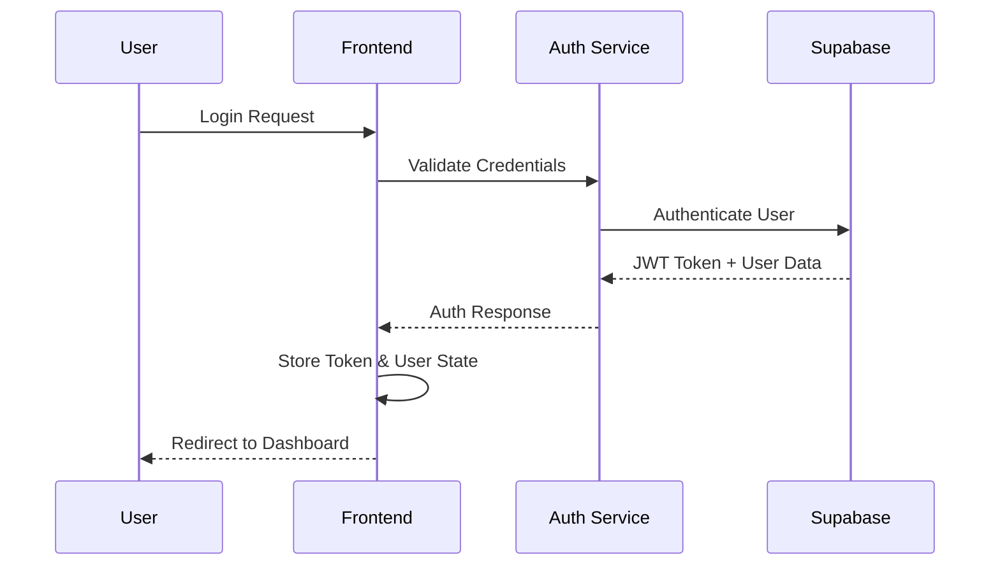
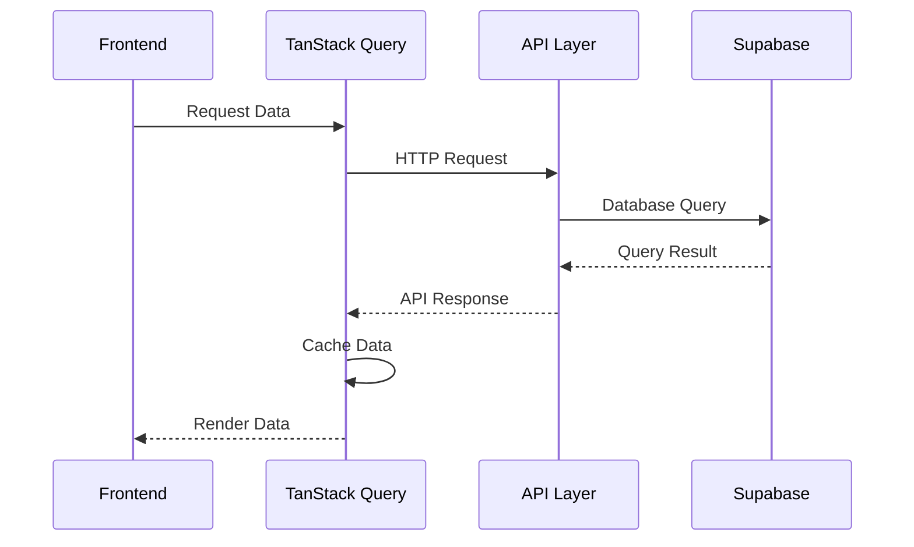
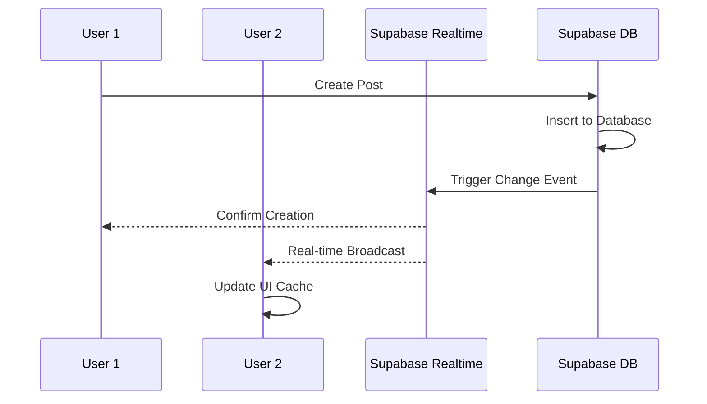
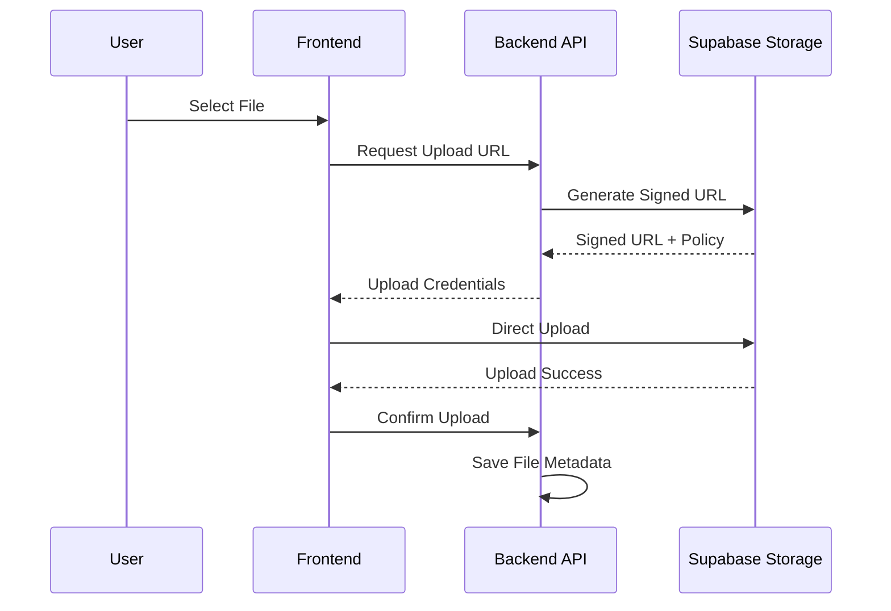

# CampusConnect System Design Document

## 1. System Overview

### 1.1 Architecture Pattern
**Microservices-Ready Monolith** with clear separation of concerns, designed for future scalability.

### 1.2 High-Level Architecture
```
┌─────────────────┐    ┌─────────────────┐    ┌─────────────────┐
│   React Client  │────│  Express API    │────│   Supabase DB   │
│   (Frontend)    │    │   (Backend)     │    │   (Database)    │
└─────────────────┘    └─────────────────┘    └─────────────────┘
         │                       │                       │
         │              ┌─────────────────┐              │
         └──────────────│  Supabase Auth  │──────────────┘
                        │   (Identity)    │
                        └─────────────────┘
```

## 2. Component Design

### 2.1 Frontend Architecture (React + TypeScript)
```
┌─────────────────────────────────────────────────────────────┐
│                     Presentation Layer                      │
├─────────────────────────────────────────────────────────────┤
│  Pages/Routes  │  Components  │  Forms  │  Layout  │  UI    │
├─────────────────────────────────────────────────────────────┤
│                    Application Layer                        │
├─────────────────────────────────────────────────────────────┤
│  Hooks  │  Context  │  State Management  │  Routing        │
├─────────────────────────────────────────────────────────────┤
│                      Service Layer                          │
├─────────────────────────────────────────────────────────────┤
│  API Client  │  Auth Service  │  Cache  │  Validation      │
├─────────────────────────────────────────────────────────────┤
│                    Infrastructure Layer                     │
├─────────────────────────────────────────────────────────────┤
│  HTTP Client  │  Storage  │  Utils  │  Types  │  Config    │
└─────────────────────────────────────────────────────────────┘
```

### 2.2 Backend Architecture (Node.js + Express)
```
┌─────────────────────────────────────────────────────────────┐
│                      API Gateway Layer                      │
├─────────────────────────────────────────────────────────────┤
│  Routes  │  Auth Middleware  │  Rate Limiting  │  API Keys  │
│  CORS    │  Request Logging  │  Throttling     │  Monitoring│
├─────────────────────────────────────────────────────────────┤
│                    Business Logic Layer                     │
├─────────────────────────────────────────────────────────────┤
│  Controllers  │  Services  │  Auth Logic  │  File Handling │
├─────────────────────────────────────────────────────────────┤
│                     Data Access Layer                       │
├─────────────────────────────────────────────────────────────┤
│  Supabase Client  │  Query Builders  │  Repositories      │
├─────────────────────────────────────────────────────────────┤
│                    Infrastructure Layer                     │
├─────────────────────────────────────────────────────────────┤
│  Database  │  Storage  │  Realtime  │  External APIs      │
└─────────────────────────────────────────────────────────────┘
```

## 3. Data Flow Design

### 3.1 Authentication Flow


### 3.2 Data CRUD Flow


### 3.3 Real-time Updates Flow (Supabase Realtime)


### 3.4 File Upload Flow (Supabase Storage)


## 4. Database Design

### 4.1 Core Tables Schema
```sql
-- Users & Authentication
profiles (
  id UUID PRIMARY KEY,
  email VARCHAR UNIQUE,
  full_name VARCHAR,
  avatar_url TEXT,
  bio TEXT,
  college VARCHAR,
  course VARCHAR,
  year INTEGER,
  created_at TIMESTAMP,
  updated_at TIMESTAMP
)

-- Posts & Content
posts (
  id UUID PRIMARY KEY,
  author_id UUID REFERENCES profiles(id),
  title VARCHAR NOT NULL,
  content TEXT,
  type VARCHAR CHECK (type IN ('text', 'image', 'poll', 'event')),
  is_anonymous BOOLEAN DEFAULT false,
  tags TEXT[],
  media_urls TEXT[],
  likes_count INTEGER DEFAULT 0,
  comments_count INTEGER DEFAULT 0,
  search_vector TSVECTOR, -- Full-text search
  created_at TIMESTAMP,
  updated_at TIMESTAMP
)

-- File Storage Metadata
file_uploads (
  id UUID PRIMARY KEY,
  user_id UUID REFERENCES profiles(id),
  post_id UUID REFERENCES posts(id),
  bucket_name VARCHAR NOT NULL,
  file_path VARCHAR NOT NULL,
  file_name VARCHAR NOT NULL,
  file_size BIGINT,
  mime_type VARCHAR,
  is_public BOOLEAN DEFAULT false,
  created_at TIMESTAMP
)

-- Comments System
comments (
  id UUID PRIMARY KEY,
  post_id UUID REFERENCES posts(id),
  author_id UUID REFERENCES profiles(id),
  content TEXT NOT NULL,
  parent_id UUID REFERENCES comments(id),
  is_anonymous BOOLEAN DEFAULT false,
  likes_count INTEGER DEFAULT 0,
  created_at TIMESTAMP
)

-- Engagement Tracking
likes (
  id UUID PRIMARY KEY,
  user_id UUID REFERENCES profiles(id),
  post_id UUID REFERENCES posts(id),
  comment_id UUID REFERENCES comments(id),
  created_at TIMESTAMP,
  UNIQUE(user_id, post_id),
  UNIQUE(user_id, comment_id)
)

-- Notifications
notifications (
  id UUID PRIMARY KEY,
  user_id UUID REFERENCES profiles(id),
  type VARCHAR CHECK (type IN ('like', 'comment', 'mention', 'follow')),
  title VARCHAR NOT NULL,
  message TEXT,
  data JSONB,
  is_read BOOLEAN DEFAULT false,
  created_at TIMESTAMP
)
```

### 4.2 Supabase Storage Buckets
```sql
-- Storage Bucket Configuration
CREATE BUCKET IF NOT EXISTS 'avatars' WITH (
  public = true,
  file_size_limit = 5242880, -- 5MB
  allowed_mime_types = ARRAY['image/jpeg', 'image/png', 'image/webp']
);

CREATE BUCKET IF NOT EXISTS 'post-media' WITH (
  public = false,
  file_size_limit = 52428800, -- 50MB
  allowed_mime_types = ARRAY['image/jpeg', 'image/png', 'image/webp', 'video/mp4']
);

-- RLS Policies for Storage
CREATE POLICY "Users can upload their own avatars" ON storage.objects
  FOR INSERT WITH CHECK (bucket_id = 'avatars' AND auth.uid()::text = (storage.foldername(name))[1]);

CREATE POLICY "Users can view all avatars" ON storage.objects
  FOR SELECT USING (bucket_id = 'avatars');
```

### 4.3 Full-Text Search Setup (Supabase)
```sql
-- Create search index
CREATE INDEX idx_posts_search ON posts USING GIN(search_vector);

-- Update search vector on insert/update
CREATE OR REPLACE FUNCTION update_posts_search_vector()
RETURNS TRIGGER AS $$
BEGIN
  NEW.search_vector := to_tsvector('english', 
    COALESCE(NEW.title, '') || ' ' || 
    COALESCE(NEW.content, '') || ' ' || 
    COALESCE(array_to_string(NEW.tags, ' '), '')
  );
  RETURN NEW;
END;
$$ LANGUAGE plpgsql;

CREATE TRIGGER posts_search_vector_update
  BEFORE INSERT OR UPDATE ON posts
  FOR EACH ROW EXECUTE FUNCTION update_posts_search_vector();
```

### 4.4 Realtime Configuration
```sql
-- Enable realtime for tables
ALTER PUBLICATION supabase_realtime ADD TABLE posts;
ALTER PUBLICATION supabase_realtime ADD TABLE comments;
ALTER PUBLICATION supabase_realtime ADD TABLE likes;
ALTER PUBLICATION supabase_realtime ADD TABLE notifications;
```

### 4.5 Indexing Strategy
```sql
-- Performance Indexes
CREATE INDEX idx_posts_created_at ON posts(created_at DESC);
CREATE INDEX idx_posts_author_id ON posts(author_id);
CREATE INDEX idx_posts_tags ON posts USING GIN(tags);
CREATE INDEX idx_posts_search ON posts USING GIN(search_vector);
CREATE INDEX idx_comments_post_id ON comments(post_id);
CREATE INDEX idx_likes_user_post ON likes(user_id, post_id);
CREATE INDEX idx_notifications_user_unread ON notifications(user_id, is_read, created_at);
CREATE INDEX idx_file_uploads_user_id ON file_uploads(user_id);
```

## 5. API Design

### 5.1 API Gateway Middleware Stack
```typescript
// Express Middleware Configuration
app.use(helmet()); // Security headers
app.use(cors(corsOptions));
app.use(compression());
app.use(morgan('combined')); // Request logging
app.use(rateLimit({
  windowMs: 15 * 60 * 1000, // 15 minutes
  max: 100, // limit each IP to 100 requests per windowMs
  message: 'Too many requests from this IP'
}));

// API Key Authentication for external services
app.use('/api/v1/external', apiKeyAuth);

// Request throttling per user
app.use('/api/v1', userThrottling({
  windowMs: 60 * 1000, // 1 minute
  max: 30 // 30 requests per minute per user
}));
```

### 5.2 RESTful API Structure
```
/api/v1/
├── auth/
│   ├── POST /signup
│   ├── POST /signin
│   ├── POST /signout
│   ├── POST /refresh
│   └── GET /me
├── posts/
│   ├── GET /posts?page=1&limit=20&sort=latest
│   ├── POST /posts
│   ├── GET /posts/:id
│   ├── PUT /posts/:id
│   ├── DELETE /posts/:id
│   └── POST /posts/:id/like
├── upload/
│   ├── POST /upload/signed-url
│   ├── POST /upload/confirm
│   └── DELETE /upload/:fileId
├── comments/
│   ├── GET /posts/:id/comments
│   ├── POST /posts/:id/comments
│   ├── PUT /comments/:id
│   └── DELETE /comments/:id
├── profiles/
│   ├── GET /profile
│   ├── PUT /profile
│   └── POST /profile/avatar
├── search/
│   ├── GET /search/posts?q=query&type=fulltext
│   └── GET /search/users?q=query
├── notifications/
│   ├── GET /notifications?unread=true
│   ├── PUT /notifications/:id/read
│   └── POST /notifications/mark-all-read
└── realtime/
    └── GET /realtime/subscribe/:channel
```

### 5.3 File Upload API Design
```typescript
// Signed URL Generation
interface SignedURLRequest {
  fileName: string;
  fileType: string;
  fileSize: number;
  bucket: 'avatars' | 'post-media';
}

interface SignedURLResponse {
  uploadUrl: string;
  fileId: string;
  expiresIn: number;
  maxFileSize: number;
}

// Upload Confirmation
interface UploadConfirmRequest {
  fileId: string;
  postId?: string;
  isPublic: boolean;
}
```

### 5.4 Response Format Standard
```typescript
interface APIResponse<T> {
  success: boolean
  data?: T
  error?: {
    code: string
    message: string
    details?: any
  }
  meta?: {
    pagination?: {
      page: number
      limit: number
      total: number
      totalPages: number
    }
    requestId: string
    timestamp: string
  }
}
```

## 6. Security Design

### 6.1 Authentication & Authorization
```typescript
// JWT Token Structure
interface JWTPayload {
  sub: string        // User ID
  email: string      // User email
  role: string       // User role
  iat: number        // Issued at
  exp: number        // Expires at
}

// Permission Matrix
const permissions = {
  'user': ['read:own', 'write:own', 'delete:own'],
  'moderator': ['read:all', 'write:all', 'delete:reported'],
  'admin': ['read:all', 'write:all', 'delete:all', 'manage:users']
}
```

### 6.2 Input Validation & Sanitization
```typescript
// Validation Schemas
const postSchema = z.object({
  title: z.string().min(1).max(200),
  content: z.string().max(5000),
  type: z.enum(['text', 'image', 'poll', 'event']),
  tags: z.array(z.string()).max(10),
  is_anonymous: z.boolean().optional()
})
```

## 7. Performance Design

### 7.1 Caching Strategy
```
┌─────────────────┐    ┌─────────────────┐    ┌─────────────────┐
│   Browser Cache │    │  TanStack Query │    │  Supabase Cache │
│   (Static Assets)│    │   (API Cache)   │    │   (DB Cache)    │
└─────────────────┘    └─────────────────┘    └─────────────────┘
         │                       │                       │
         └───────────────────────┼───────────────────────┘
                                 │
                    ┌─────────────────┐
                    │ Supabase Storage│
                    │   (CDN Cache)   │
                    └─────────────────┘
```

### 7.2 Realtime Performance (Supabase Realtime)
```typescript
// Frontend Realtime Setup
const supabase = createClient(url, key, {
  realtime: {
    params: {
      eventsPerSecond: 10 // Rate limiting
    }
  }
});

// Subscribe to specific channels
const channel = supabase
  .channel('posts-changes')
  .on('postgres_changes', 
    { event: '*', schema: 'public', table: 'posts' },
    (payload) => {
      // Update local cache
      queryClient.invalidateQueries(['posts']);
    }
  )
  .subscribe();
```

### 7.3 Search Performance
```typescript
// Supabase Full-Text Search Implementation
const searchPosts = async (query: string, filters?: SearchFilters) => {
  const { data, error } = await supabase
    .from('posts')
    .select('*, profiles(full_name, avatar_url)')
    .textSearch('search_vector', query, {
      type: 'websearch',
      config: 'english'
    })
    .range(0, 19); // Pagination
    
  return data;
};

// Alternative: External Search Service Integration
const searchWithMeilisearch = async (query: string) => {
  const response = await fetch('/api/v1/search/external', {
    method: 'POST',
    body: JSON.stringify({ query, index: 'posts' })
  });
  return response.json();
};
```

### 7.4 Optimization Techniques
- **Frontend**: Code splitting, lazy loading, image optimization via Supabase Storage CDN
- **Backend**: Query optimization, Supabase connection pooling, response compression
- **Database**: Proper indexing, full-text search optimization, read replicas
- **Storage**: Automatic image resizing, WebP conversion, CDN distribution

## 8. Scalability Design

### 8.1 Horizontal Scaling Plan
```
Load Balancer
     │
┌────┴────┐
│ API     │ API     │ API
│ Server  │ Server  │ Server
│ (Node1) │ (Node2) │ (Node3)
└────┬────┘
     │
┌────┴────┐
│ Database│ Database│ Database
│ Primary │ Replica │ Replica
└─────────┘
```

### 8.2 Microservices Migration Path
```
Current Monolith → Service Extraction → Independent Services

1. Auth Service
2. Post Service  
3. User Service
4. Notification Service
5. Search Service
```

## 9. Monitoring & Observability

### 9.1 Metrics Collection
```typescript
interface Metrics {
  performance: {
    responseTime: number
    throughput: number
    errorRate: number
    realtimeConnections: number
  }
  business: {
    activeUsers: number
    postsCreated: number
    engagementRate: number
    storageUsage: number
  }
  infrastructure: {
    cpuUsage: number
    memoryUsage: number
    diskUsage: number
    supabaseConnections: number
  }
}
```

### 9.2 Notification System Design
```typescript
// Multi-channel Notification Delivery
interface NotificationChannel {
  type: 'realtime' | 'push' | 'email' | 'sms';
  enabled: boolean;
  config: Record<string, any>;
}

// Realtime Notifications (Supabase Realtime)
const sendRealtimeNotification = async (userId: string, notification: Notification) => {
  await supabase
    .channel(`user-${userId}`)
    .send({
      type: 'broadcast',
      event: 'notification',
      payload: notification
    });
};

// Push Notifications (Web Push API)
const sendPushNotification = async (subscription: PushSubscription, payload: any) => {
  await webpush.sendNotification(subscription, JSON.stringify(payload));
};

// Email Notifications (Supabase Edge Functions)
const sendEmailNotification = async (email: string, template: string, data: any) => {
  await supabase.functions.invoke('send-email', {
    body: { email, template, data }
  });
};
```

### 9.3 Logging Strategy
```typescript
interface LogEntry {
  timestamp: string
  level: 'info' | 'warn' | 'error' | 'debug'
  service: string
  userId?: string
  action: string
  metadata: Record<string, any>
  requestId: string
  supabaseRequestId?: string
}
```

## 10. Deployment Design

### 10.1 Environment Strategy
```
Development → Staging → Production

├── Local Development
│   ├── Frontend: localhost:5173
│   ├── Backend: localhost:3000
│   └── Database: Supabase Dev
├── Staging Environment
│   ├── Frontend: staging.campusconnect.com
│   ├── Backend: api-staging.campusconnect.com
│   └── Database: Supabase Staging
└── Production Environment
    ├── Frontend: campusconnect.com
    ├── Backend: api.campusconnect.com
    └── Database: Supabase Production
```

### 10.2 CI/CD Pipeline & Testing Strategy
```yaml
# Comprehensive Testing & Deployment Pipeline
stages:
  - test
  - build
  - deploy

test:
  unit_tests:
    frontend: 
      - framework: Vitest
      - coverage: 80%+
      - components: React Testing Library
    backend:
      - framework: Jest
      - coverage: 85%+
      - mocking: Supabase client mocks
  
  integration_tests:
    - API endpoint testing
    - Database integration tests
    - Supabase Realtime testing
    - File upload/download flows
    
  e2e_tests:
    - framework: Playwright
    - scenarios: Critical user journeys
    - browsers: Chrome, Firefox, Safari
    - mobile: iOS Safari, Android Chrome

  security_tests:
    - OWASP ZAP scanning
    - Dependency vulnerability check
    - Supabase RLS policy validation

build:
  frontend:
    - Vite production build
    - Bundle analysis
    - Asset optimization
    - Environment-specific configs
  
  backend:
    - TypeScript compilation
    - Docker image creation
    - Environment validation
    - Supabase migration checks

deploy:
  staging:
    - Automated deployment
    - Smoke tests
    - Performance benchmarks
    - Supabase staging sync
  
  production:
    - Blue-green deployment
    - Health checks
    - Rollback capability
    - Monitoring alerts
```

### 10.3 Testing Framework Configuration
```typescript
// Vitest Configuration (Frontend)
export default defineConfig({
  test: {
    environment: 'jsdom',
    setupFiles: ['./src/test/setup.ts'],
    coverage: {
      provider: 'v8',
      reporter: ['text', 'json', 'html'],
      threshold: {
        global: {
          branches: 80,
          functions: 80,
          lines: 80,
          statements: 80
        }
      }
    }
  }
});

// Jest Configuration (Backend)
export default {
  preset: 'ts-jest',
  testEnvironment: 'node',
  setupFilesAfterEnv: ['<rootDir>/src/test/setup.ts'],
  coverageThreshold: {
    global: {
      branches: 85,
      functions: 85,
      lines: 85,
      statements: 85
    }
  },
  testMatch: ['**/__tests__/**/*.test.ts']
};

// Playwright Configuration (E2E)
export default defineConfig({
  testDir: './e2e',
  fullyParallel: true,
  forbidOnly: !!process.env.CI,
  retries: process.env.CI ? 2 : 0,
  workers: process.env.CI ? 1 : undefined,
  reporter: 'html',
  use: {
    baseURL: 'http://localhost:5173',
    trace: 'on-first-retry',
  },
  projects: [
    { name: 'chromium', use: { ...devices['Desktop Chrome'] } },
    { name: 'firefox', use: { ...devices['Desktop Firefox'] } },
    { name: 'webkit', use: { ...devices['Desktop Safari'] } },
    { name: 'Mobile Chrome', use: { ...devices['Pixel 5'] } },
  ],
});
```

## 11. Error Handling Design

### 11.1 Error Classification
```typescript
enum ErrorType {
  VALIDATION = 'VALIDATION_ERROR',
  AUTHENTICATION = 'AUTH_ERROR',
  AUTHORIZATION = 'PERMISSION_ERROR',
  NOT_FOUND = 'NOT_FOUND',
  SERVER_ERROR = 'INTERNAL_ERROR',
  RATE_LIMIT = 'RATE_LIMIT_ERROR'
}
```

### 11.2 Error Recovery Strategy
- **Frontend**: Error boundaries, retry mechanisms, fallback UI
- **Backend**: Circuit breakers, graceful degradation, health checks
- **Database**: Connection retry, transaction rollback, backup strategies

## 12. Implementation Roadmap

### Phase 1: Foundation (Week 1-2)
- ✅ Basic authentication system
- ✅ Core CRUD operations
- ✅ Database schema setup
- ✅ API structure implementation

### Phase 2: Features (Week 3-4)
- 🔄 Real-time updates
- 🔄 File upload system
- 🔄 Search functionality
- 🔄 Notification system

### Phase 3: Enhancement (Week 5-6)
- ⏳ Performance optimization
- ⏳ Security hardening
- ⏳ Comprehensive testing
- ⏳ Monitoring setup

### Phase 4: Production (Week 7-8)
- ⏳ Deployment pipeline
- ⏳ Load testing
- ⏳ Documentation
- ⏳ Go-live preparation

## 13. Risk Mitigation

### 13.1 Technical Risks
- **Database Performance**: Implement proper indexing and query optimization
- **Scalability Issues**: Design with horizontal scaling in mind
- **Security Vulnerabilities**: Regular security audits and updates

### 13.2 Business Risks
- **User Adoption**: Focus on UX and performance
- **Data Privacy**: Implement GDPR compliance
- **Content Moderation**: Automated and manual moderation systems

This design document provides the blueprint for building a scalable, secure, and maintainable CampusConnect platform.
